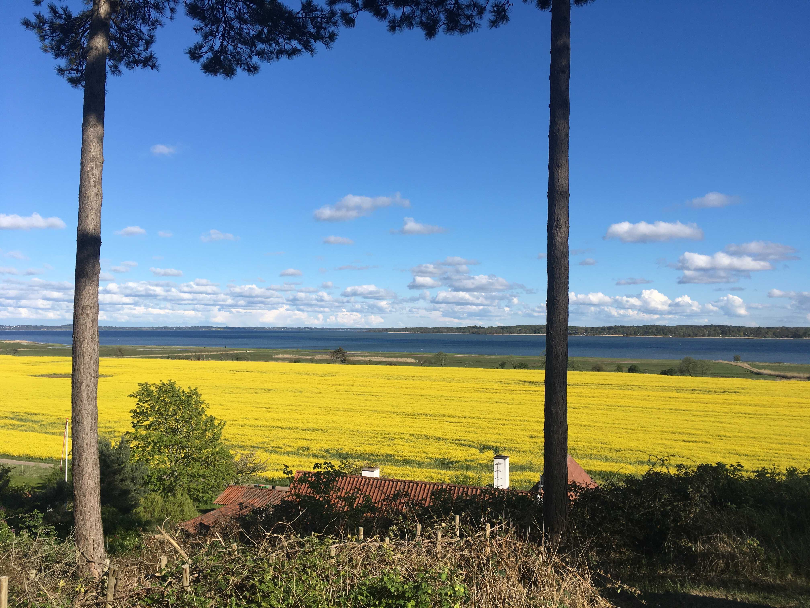

::: column-body

:::

::: {.column-page style="text-align: center;"}
[**Velkommen til Grønnæsse Bakker i Sølager**]{style="font-size: 2em;"}
:::

Grundejerforeningen Grønnæsse Bakker i Sølager omfatter 49 grunde mellem Sølagervejen og Grønnesse Skov. Området blev udstykket til sommerhuse i 1965.

Mod syd forbindes området med 2 trapper til Grønnehavevej. Herfra er der 500 m til Roskilde fjord og 500 m til Grønnesse Skov.

Her på hjemmesiden kan du læse nyheder og om projekter i foreningen. Du finder også foreningens vedtægter, referater fra generalforsamlinger, regnskaber samt relevante offentlige dokumenter.

Med venlig hilsen\
Bestyrelsen

::: {.callout-note appearance="simple" collapse="false"}
## Seneste opdateringer

- 01.05.2026: Tilføjet GF referat 2026 og regnskab 2025 under [Foreningens dokumenter](dok_forening.html#generalforsamlinger-referater), tilføjet info fra Halsnæs Kommune om beskæring af træer og buske langs veje under [Offentlige dokumenter](dok_offentlig.html#halsnæs-kommune) samt ny formand under [Bestyrelsen](kontakt.qmd#bestyrelsen)
- 01.04.2026: Tilføjet indkaldelse og dagsorden for GF 2026 og regnskab 2025 under [Generalforsamlinger](https://groennaessebakker.dk/posts/GF_info).
- 25.06.2025: Tilføjet GF referat 2025 og regnskab 2024 under [Foreningens dokumenter](https://groennaessebakker.dk/dok_forening.html#generalforsamlinger-referater)
- 15.04.2025: Fotos fra [vest trappen efter jordskredssikring](posts/trapper/index.qmd#jordskredssikring-i-marts-2025) og link til gamle [luftfotos fra Sølager](dok_omraadet.qmd#danmark-set-fra-luften-før-google).
- 09.09.2024: Foreningens kontaktoplysninger på siden "Kontakt" er opdateret.
- 23.05.2024: Tilføjet GF referat 2024 og regnskab 2023.

:::
